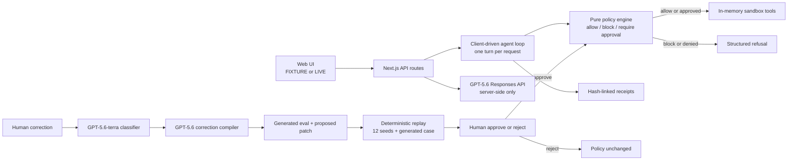

# Covenant

Covenant is a governance-and-immunity layer for tool-using AI agents. It compiles plain-English rules into a typed policy, deterministically intercepts every tool call before execution, emits hash-linked action receipts, and turns each human correction into a regression eval plus an approval-gated policy patch.

Created 2026-07-18 during the OpenAI Build Week submission period (Jul 13–21, 2026). Developer Tools track.

Milestones M0–M8 are implemented and the production fixture golden path is deployed.

**The loop:** compile → intercept → prove → immunize. The model suggests; the deterministic engine decides; the human activates policy changes.

- Demo: https://covenant-umber.vercel.app
- Repository: https://github.com/jayadevrana/covenant
- Judge walkthrough: [docs/JUDGE_CARD.md](docs/JUDGE_CARD.md)

## What to test first

Open the demo and choose **Launch golden task → Run seeded fixture**. Approve the bulk sandbox send. Covenant allows three low-risk steps, requires approval for one bulk send, and blocks an external customer-data send before its tool executes. Verify the receipt chain, then correct the blocked action and preview the deterministic 12/13 → 13/13 immunity proof before activating policy v2.

The fixture path requires no API key, account, or real-world integration. All tools operate only on in-memory sample data.

## Fresh-clone setup

Requirements: Node.js 20 or newer and npm.

```bash
git clone https://github.com/jayadevrana/covenant.git
cd covenant
npm ci
npm test
npm run dev -- --port 3010
```

Open http://localhost:3010. No environment file is needed for fixture mode.

For optional live mode, copy `.env.example` to `.env.local`, replace the placeholder key, keep the budget defaults, and restart the server:

```bash
cp .env.example .env.local
npm run dev -- --port 3010
```

`OPENAI_API_KEY` is read only by server routes. Never use a `NEXT_PUBLIC_` key.

## Sample data

Fixture mode ships with 12 fictional customers on reserved `.example` domains, three fictional documents, one external partner contact, a seven-rule typed policy, a five-action golden trace, and 12 seed regression evals. The six generic sandbox tools—`search_customers`, `read_document`, `draft_email`, `send_email`, `export_records`, and `publish_report`—only mutate in-memory outbox/log objects. Nothing sends email, publishes data, exports records, or reaches an external service.

## Architecture



The runtime decision path contains no model call. `lib/engine/` is pure TypeScript with timestamps passed in. The same evaluator runs during live interception and eval replay.

## How GPT-5.6 is integrated

| Surface | Model and API | Responsibility | Fixture behavior |
|---|---|---|---|
| Policy compiler | `gpt-5.6` via Responses API, low reasoning, ≤2,000 output tokens | Suggest a strict typed policy from plain-English rules | Ships the validated seven-rule compiled fixture |
| Sandbox agent | `gpt-5.6` via Responses API function tools, low reasoning, ≤2,000 output tokens per client-driven turn | Propose the next tool call; receives structured refusal when blocked or denied | Replays the seeded five-action golden trace without a model call |
| Correction loop | `gpt-5.6-terra` classifies the failure; `gpt-5.6` suggests one generated eval and candidate patch | Turn human feedback into reviewable artifacts, never an automatic policy change | Uses a deterministic compiled correction fixture |

Every compiler request uses strict Structured Outputs and every result is re-validated with Zod. Invalid output is retried once with validation details, then shown visibly with its raw output. Model provenance is labeled `LIVE · <model-id>`; seeded data is labeled `FIXTURE`.

## Deterministic enforcement and receipts

The engine derives recipient count, external domains, customer-data presence, data classes, and attachment names from tool arguments. Multiple matches use most-restrictive precedence: block > require approval > allow. Exceptions fail closed. A blocked or denied action returns a structured refusal and never invokes the underlying tool; this is execution-recorder tested.

Receipt hashes encode UTF-8 stable JSON with recursively sorted object keys, preserved array order, normalized negative zero, and rejection of undefined/non-finite values. Each event includes the prior event hash; the genesis previous hash is 64 zeroes. Receipts are tamper-evident within an export, not cryptographic signatures.

## Deployment and budget controls

Vercel deployment uses ephemeral in-memory sandbox sessions. A serverless cold start or another instance may expire a run; the UI reports **“Sandbox session expired — start a fresh run.”** and keeps fixture mode available.

Production environment variables:

| Variable | Required | Meaning |
|---|---|---|
| `OPENAI_API_KEY` | Live mode only | Server-side API credential; fixture mode does not read it |
| `MAX_LIVE_RUNS_PER_SESSION` | Recommended: `3` | May lower the cap; code never permits more than three live starts per browser session |
| `DAILY_SPEND_KILL` | Recommended: `0` | Set to `1` to reject every live start immediately while fixture mode continues |

The per-session limit is carried in an HttpOnly, SameSite cookie and marked Secure over HTTPS. Existing compiler and agent output caps remain ≤2,000 tokens.

```bash
vercel link --yes
vercel deploy --prod --yes
```

Add secrets through `vercel env add` or the Vercel project settings; never commit them. After changing an environment variable, redeploy production.

## Integrate the SDK

The private in-repo `@covenant/sdk` package supports Node.js 20+ and any agent framework that lets application code wrap tool execution.

```ts
import { seedPolicy } from "./data/seed";
import { withCovenant } from "./sdk";

const covenant = withCovenant(
  {
    send_email: {
      name: "send_email",
      execute: async (args) => sandboxSend(args),
    },
  },
  seedPolicy,
  {
    onApprovalNeeded: async (action, decision) => showApproval(action, decision),
  },
);

const result = await covenant.tools.send_email.execute({
  recipients: ["reviewer@external.example"],
  data_classes: ["customer_data"],
});

console.log(result);                    // tool result or structured refusal
console.log(covenant.verifyReceipts()); // re-walk the receipt chain
```

If `onApprovalNeeded` is absent, approval defaults to denied. Run the portable terminal proof with:

```bash
npx tsx examples/minimal-agent.ts
```

The web transport uses camelCase requests while binding domain objects retain their specified snake_case fields:

| Endpoint | Request JSON |
|---|---|
| `POST /api/run/start` | `{ task, mode: "fixture" | "live" }` |
| `POST /api/run/step` | `{ runId }` |
| `POST /api/run/approval` | `{ runId, approved: boolean }` |
| `POST /api/correction/compile` | `{ runId, actionId, whatShouldHaveHappened }` |
| `POST /api/correction/decision` | `{ runId, decision: "approve" | "reject" }` |

## Testing

```bash
npm test                         # unit + mocked integration tests
npx tsc --noEmit                 # strict TypeScript
npm run lint                     # ESLint
npm run build                    # production Next.js build
npx playwright install chromium # one-time browser install
npm run test:e2e                # complete keyless golden path on port 3010
PLAYWRIGHT_BASE_URL=https://covenant-umber.vercel.app npm run test:e2e
npx tsx examples/minimal-agent.ts
```

Optional, frugal live checks:

```bash
npm run smoke:openai   # tiny model-access sanity check
npm run smoke:compiler # seven-rule policy compilation
npm run smoke:agent    # one live golden task
npm run smoke:immunity # classifier + one correction compilation
```

The live scripts load `OPENAI_API_KEY` from the process or `.env.local`; `smoke:openai` exits successfully with a deferred message when no key is present.

## Related work

Covenant builds on a growing ecosystem of agent governance. [Amazon Bedrock AgentCore Policy](https://docs.aws.amazon.com/bedrock-agentcore/latest/devguide/policy.html) provides deterministic Cedar enforcement at an AWS gateway; Covenant is a portable in-process layer and adds a human correction → generated eval → approval-gated typed patch loop with before/after replay. [Invariant Labs, now part of Snyk](https://labs.snyk.io/resources/snyk-labs-invariant-labs/), focuses on agent security policies, trace inspection, and guardrails; Covenant’s narrower contribution is turning one correction into a permanent regression case and a separately approved policy change. [HumanLayer](https://github.com/humanlayer/humanlayer) established useful human-in-the-loop approval patterns; Covenant connects approval to deterministic policy versions, receipts, and correction-derived regression proof. [Latitude](https://docs.latitude.so/guides/evaluations/integrating-evaluations-workflow) provides prompt and agent evaluation workflows; Covenant places deterministic eval replay directly in a pre-execution tool-policy loop and previews a specific policy diff. [Trinitite](https://trinitite.ai/platform/) describes deterministic governance, audit, and automated immune-system concepts; Covenant’s implemented unit of learning is specifically a human-authored correction compiled into a reviewable eval plus typed rule patch that cannot activate without approval. The [Progent paper](https://arxiv.org/abs/2504.11703) presents programmable least-privilege policies and model-assisted policy generation; Covenant adds hash-linked action receipts and a visible per-correction before/after regression grid in a small framework-neutral SDK and web demo.

## How Codex built this project

This repository’s core functionality was built in one primary Codex project thread, milestone by milestone, during the submission period. The human locked the product concept, binding schemas, model routing, cost ceiling, approval semantics, fixture honesty, in-memory deployment choice, and milestone gates. Codex translated that specification into the pure engine, mocked sandbox, strict Responses API compilers, client-driven agent loop, receipt chain, immunity runner, product UI, Playwright flow, SDK, deployment controls, tests, and submission documentation.

The workflow used an evidence gate after every milestone: inspect the surviving tree, implement the smallest locked scope, run deterministic and mocked tests, use live calls only where the gate demanded them, record actual output in [EVIDENCE.md](EVIDENCE.md), and let the human independently verify and commit. Codex accelerated schema duplication checks, edge-case test generation, API/UI wiring, execution-recorder proof, receipt tamper tests, before/after eval replay, and release auditing. Human review caught and fixed three strict Playwright selector collisions before M6 was committed. The eight milestone commits before shipping preserve that human-reviewed progression.

## Integrity and limitations

- Covenant is a prototype safety layer, not proof that agents are universally safe.
- In-process SDK enforcement is bypassable by code that does not route tool execution through the wrapper.
- Sandbox sessions are ephemeral and contain only fictional fixture data.
- Compiler output is a suggestion; only the deterministic engine decides at runtime and only a human activates patches.
- Receipts are SHA-256 hash-linked and tamper-evident within an export; they are not signatures.

## License and assets

Project source is licensed under the [MIT License](LICENSE). The UI uses code, CSS, and the framework-provided Geist font only. There are no commissioned, stock, generated, or third-party visual/audio assets. Third-party material is limited to the open-source npm dependencies declared in `package.json`; their licenses remain with their respective authors.
